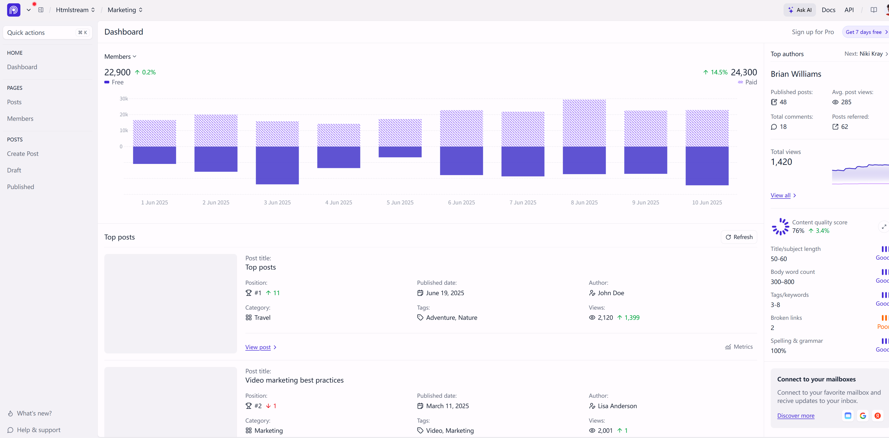

# ng-boot-oauth
[中文介绍](README-zh.md)

An oauth2 demo with angularjs and springboot.
Default username is `user`, and password is `password`.

## 1. Features
### Modules

The project contains 3 modules
* authserver
* ui (A client using oauth2 code flow)
* ui-spa (A client using oauth2 pkce flow, with a standalone frontend module)

### Frontend
* Angular 19
* React 19
* Vue 3

### Backend
* Gradle Build Tool 
* Spring Boot
* Spring security Oauth2 integration
* Thymeleaf server-side Java template engine

## 2. RUNNING IN DEVELOPMENT MODE
Note that **ui** module and **ui-spa** module can't be running at the same time, because they use the same port 8080.
### GET THE CODE
```bash
git clone https://github.com/qihaiyan/ng-boot-oauth.git
cd ng-boot-oauth
```

### RUNNING OAuth2 Server
```bash
cd authserver
./gradlew bootRun
```

### RUNNING ui MODULE
```bash
cd ui
npm i
npm run dev
./gradlew bootRun
```
Now we can visit the app at `http://127.0.0.1:8080`

### RUNNING ui-spa MODULE

* RUNNING BACKEND SERVER
```bash
cd ui-spa
./gradlew bootRun
```

If it's the first time to run ui-spa module, install dependencies at first.
```bash
cd ui-spa
npm install
```

* RUNNING DEV SERVER
```bash
cd ui-spa
npm run dev
```

Now we can visit the app at `http://127.0.0.1:4200`
